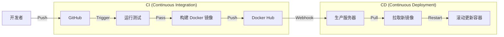

# 🗺️ 声纹识别智能门禁系统 — 终极升级路线图

> **本文档是唯一权威的升级参考。**
> 原 `docs/upgrade_plans/` 下 11 个散落规划文档已于 2026-02-26 合并至本文件后删除。

---

## 一、当前项目架构 (Architecture)

我们已经完成了从单体脚本到微服务化、容器化的转型。目前的系统架构如下：

```mermaid
graph TD
    User[用户 (Browser/App)] -->|HTTP/WebSocket| Nginx[Gateway (待接入)]
    Nginx --> Frontend[前端容器 (Vue3 + Vite)]
    Nginx --> Backend[后端容器 (Django REST)]
    
    subgraph "Core Services (Docker Network)"
        Backend -->|HTTP Request| AIService[AI Service 容器 (FastAPI)]
        AIService -->|Load| Model[ECAPA-TDNN 模型]
        AIService -->|Read/Write| ChromaDB[向量数据库 (Embedded)]
        AIService -->|Read/Write| Redis[Redis 缓存 (待启用)]
    end
    
    subgraph "Data Persistence"
        MySQL[(MySQL 8.0)]
        ChromaFiles[Chroma Data Volume]
        RawAudio[Raw Audio Volume]
    end

    Backend --> MySQL
    AIService -.-> RawAudio
    ChromaDB -.-> ChromaFiles
```

**关键变更点**：
1.  **数据层**：`.npy` 文件已全面废弃（仅训练流程保留），生产环境完全依赖 **ChromaDB**。
2.  **服务层**：`VoiceService` 已拆分为独立的 FastAPI 服务，支持热重载。
3.  **部署层**：全栈 Docker Compose 编排，支持一键启动。

---

## 二、深度学习升级路线（AI 核心）

目标：将毕设 AI 部分从"训练一个模型"升级为"一套可解释、可展示的声纹研究链路"。

### Level 1-3：基线与鲁棒性 ✅ 已完成
- ECAPA-TDNN 模型训练收敛
- 噪声鲁棒性测试（Clean/Street/White Noise）
- 特征对比（MFCC vs Mel-Spectrogram）

### Level 4：训练策略实验 ✅ 代码就绪
- Early Stopping vs 固定 Epoch 对比：`train.py` 已支持 `--early_stop` 与 `--patience` 参数
- 实验执行命令：`python -m scripts.train --config configs/train.yaml --early_stop`

### Level 5：嵌入空间可视化 ✅ 已完成
- 脚本入口：`scripts/analysis/plot_embedding.py`
- 前端展示：`AdminModelTab.vue` 已集成 t-SNE 动态展示

### Level 6：分数归一化 ✅ 已完成
- 支持方法：Z-Norm / T-Norm / S-Norm (`--score_norm` 参数)
- 效果：显著降低了不同模型版本的阈值漂移问题

---

## 三、系统工程化升级路线

### Phase 1：地基固化 🟢 已完成

| 任务 | 状态 | 说明 |
|:---|:---:|:---|
| ChromaDB 向量数据库集成 | ✅ | 替代 .npy 文件遍历 |
| AI Service 独立化（FastAPI） | ✅ | Django 通过 HTTP 调用 AI 能力 |
| Docker Compose 基础编排 | ✅ | DB + AI Service + Backend + Frontend |
| 数据迁移脚本验证 | ✅ | `migrate_to_chroma.py` 验证通过 |
| 移除 .npy 遗留逻辑 | ✅ | 强制使用 ChromaDB，移除 `load_templates` 回退逻辑 |

### Phase 2：核心工程化 🟡 下一步重点 (Sprint 4)

| 任务 | 优先级 | 说明 |
|:---|:---:|:---|
| Redis 引入 | ⭐⭐⭐ | 登录状态、门禁缓存、限流计数 |
| JWT 统一鉴权 | ⭐⭐⭐ | JWT + Redis blacklist |
| 消息队列解耦 | ⭐⭐⭐ | 为实时对话做准备 (API → Redis Pub/Sub → AI) |
| Celery 异步任务 | ⭐⭐ | 日志写入、延迟任务、数据清理 |

### Phase 3：云原生与 CI/CD 自动化 � 规划中
> **目标**：实现“代码提交即部署”，构建高可用集群架构。

| 任务 | 说明 | 技术栈 |
|:---|:---|:---|
| **CI 流水线 (GitHub Actions)** | 代码推送自动触发单元测试、代码风格检查 (Lint)、镜像构建 | GitHub Actions, Flake8, PyTest |
| **CD 流水线 (自动部署)** | 镜像推送到 Docker Hub，服务器自动拉取并重启服务 (Watchtower) | Docker Hub, Watchtower |
| **Kubernetes 迁移 (K8s)** | 编写 Deployment/Service/Ingress YAML，实现 Pod 自动扩缩容 (HPA) | Kubernetes, Helm, Minikube |
| **可观测性 (Observability)** | 采集 Logs (Loki), Metrics (Prometheus), Traces (Jaeger) | Grafana Stack, OpenTelemetry |

#### CI/CD Pipeline 设计预览


---

## 四、Agent 智能化升级路线 (Omni)

目标：从"身份验证(你是谁)"升级为"身份感知 + 意图理解 + 主动执行"。

### 阶段一：感知能力构建 ✅ 基础完成
- STT 引擎集成（Faster-Whisper）
- WebSocket 流式端点 `/ws/audio`
- VAD 语音活动检测（webrtcvad）

### 阶段二：Agent 决策 ✅ 基础完成
- LangChain Agent + DeepSeek V3 集成
- Tools 定义：open_door / turn_on_light / alert_police

### 阶段三：未来交互形态 (Real-time Omni) 🟣 规划中
| 任务 | 说明 |
|:---|:---|
| 实时全双工对话 | VAD 打断 + 流式 STT + 流式 LLM + 流式 TTS |
| 多模态感知 | 视觉 (Video) + 听觉 (Audio) 联合决策 |
| 本地化大模型 | 部署 Qwen2-Audio 或 Mini-Omni 替代 API 调用 |

---

## 五、Sprint 行动计划

> 原则：**修 Bug → 补实验 → 稳工程 → 写论文**

### Sprint 3：系统稳定性与工程收尾（当前阶段） 🟢 收尾中
| 任务 | 预期结果 |
|:-----|:---------|
| 移除遗留脚本 | ⚠️ 保留 | `feature_extraction.py` 仍需用于模型训练流程 (Training Pipeline) |
| 统一配置管理 | ✅ 确保 Docker/Local 环境配置读取逻辑一致 |
| 前端错误处理 | ⏳ 优化 API 错误提示，避免出现 "KeyError" 等原始报错 |
| 文档同步 | ✅ 更新架构图，反映最新的 ChromaDB 架构 |

### Sprint 4：核心中间件引入（Redis） 🟡 待启动
> **目标**：引入 Redis 作为系统“神经中枢”，解决缓存与任务队列问题。
- [ ] Docker Compose 添加 Redis 服务 (已配置，需启用)
- [ ] Django 集成 `django-redis`
- [ ] 实现 API 速率限制 (Throttling)
- [ ] 实现 WebSocket 消息广播 (Channel Layers)

### Sprint 6：论文 & 交付（毕设收尾）
| 任务 | 预期结果 |
|:-----|:---------|
| 毕业设计说明书 | 规范格式，含全部实验数据 |
| 外文翻译 + 原文 | ≥ 3000 字 |
| 答辩 PPT + 演示脚本 | 含应急方案 |

---

> 📌 **本文档最后更新**：2026-02-27
> 如需修改升级优先级或新增路线，请直接编辑本文件，不要再新建散落文档。
