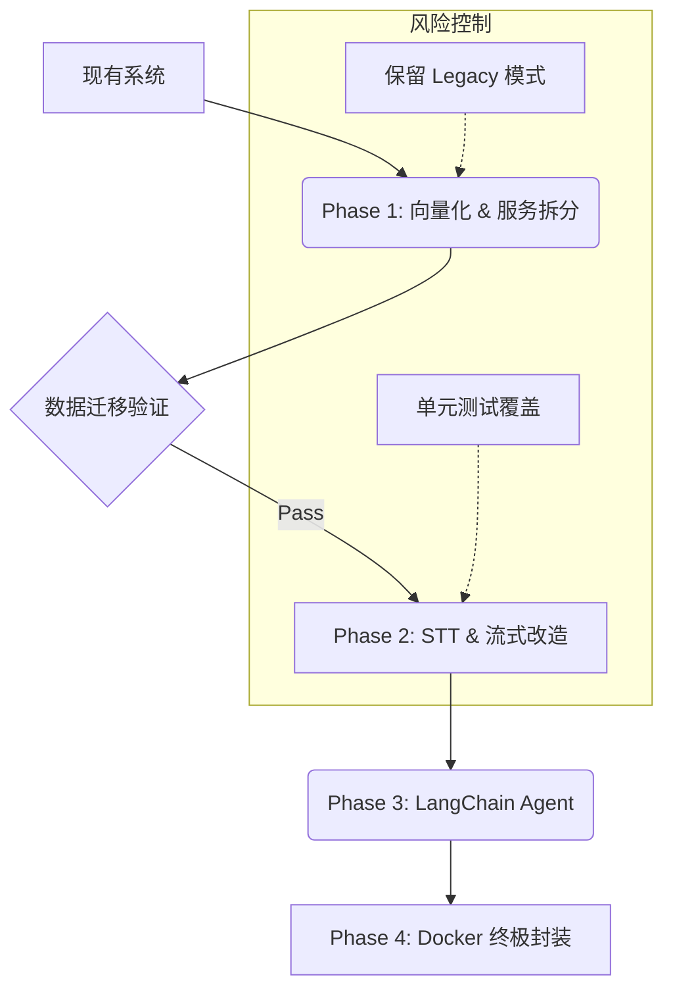

# 🗺️ 智能声纹管家：工程化与 Agent 融合演进总路线图 (Master Plan)

## 1. 核心战略：双线并行，分层融合
为了避免“工程化重构”与“Agent 功能开发”相互打架，我们将项目演进划分为三个层次：**基础设施层 (Infrastructure)**、**核心服务层 (Core Services)**、**应用交互层 (Application)**。

*   **原则**：先稳固地基（向量库、Docker），再构建能力（STT、流式），最后串联场景（Agent）。

---

## 2. 演进阶段里程碑 (Phases)

### Phase 1: 地基固化 (Foundation) 🟢 **(Current Status)**
*目标：完成数据层面的现代化改造，为 Agent 提供高性能检索能力，同时保持现有功能稳定。*

*   **[Infra] 向量数据库集成** (✅ 已完成)
    *   引入 ChromaDB。
    *   封装 `VectorStore` 接口，替代 `.npy` 文件遍历。
    *   **关键动作**：执行数据迁移脚本，确保旧数据无损进入新架构。
*   **[Core] AI Service 独立化** (✅ 已完成)
    *   FastAPI 封装 VoiceService。
    *   Django 通过 HTTP 调用 AI 能力。
*   **[Engineering] 基础容器化** (⏳ 待执行)
    *   编写 `docker-compose.yml`，编排 Django + AI Service + ChromaDB (如有独立服务需求) + Redis。

### Phase 2: 感知能力构建 (Perception) 🟡
*目标：让系统“听得见”且“听得懂”，从离线文件处理升级为实时流式感知。*

*   **[Core] STT 引擎集成**
    *   引入 `Faster-Whisper` 或 `FunASR` 到 AI Service。
    *   提供 `/transcribe` 接口（文本转录）。
*   **[Core] 流式处理流水线 (Streaming Pipeline)**
    *   **WebSocket 端点**：在 AI Service 中开启 `/ws/audio`。
    *   **VAD (静音检测)**：集成 `webrtcvad` 或 `silero-vad`，在流中切分语音片段。
    *   **Ring Buffer**：实现音频缓冲池，支持滑动窗口特征提取。

### Phase 3: 认知与决策 (Cognition & Action) 🔴
*目标：赋予系统“大脑”，连接感知结果与物理世界。*

*   **[App] Agent 逻辑构建**
    *   引入 **LangChain**。
    *   定义 **Tools (工具集)**：`OpenDoor`, `TurnOnLight`, `AlertPolice`。
    *   编写 Prompt Template：将“身份(Alice)” + “内容(开灯)” 转化为 Action。
*   **[App] 交互层升级**
    *   前端从“上传文件”改为“按住说话 (WebSocket 推流)”。
    *   后端增加“意图反馈”接口，不仅仅返回“通过/拒绝”，而是返回“正在为您开灯”。

### Phase 4: 全面工程化 (Production Ready) 🔵
*目标：达到毕设/演示的最终交付标准，强调稳定性与可维护性。*

*   **[Infra] 全栈容器化**
    *   完善 Docker Compose，一键拉起所有组件 (Django, AI Service, Redis, Chroma, Frontend)。
*   **[DevOps] 监控与日志**
    *   引入 Prometheus/Grafana (可选) 或基本的 structured logging。
    *   记录 Agent 的决策链路 (Thought Chain)，用于演示。

---

## 3. 依赖关系与风险控制 (Dependency Graph)

### 关键防冲突策略：
1.  **接口兼容**：AI Service 在开发 WebSocket 接口时，**必须保留** 原有的 HTTP `/enroll` 和 `/verify` 接口，保证 Django 现有业务不挂。
2.  **开关控制**：在 Django 中增加 `ENABLE_AGENT_MODE` 开关。关闭时走旧逻辑（文件上传+声纹），开启时走新逻辑（WebSocket+Agent）。
3.  **数据双写**：在 Phase 1 过渡期，注册声纹时同时写 `.npy` 和 Chroma，确保随时可以回滚。

---

## 4. 下一步具体执行清单 (Next Steps)

1.  **验证 Chroma 迁移**：
    *   运行 `python -m scripts.data.migrate_to_chroma`。
    *   手动测试 `VoiceService.verify` 确认检索正常。
    *   *(此步骤不仅是技术验证，更是为了让 Phase 2 的流式检索有数据可查)*

2.  **集成 STT (Faster-Whisper)**：
    *   这是 Agent 的耳朵，必须先装上。
    *   在 AI Service 中添加 STT 模块。

3.  **开发 WebSocket 接口**：
    *   打通从“接收音频流”到“返回识别结果”的通路。

---
**批准建议**：
请确认是否同意按此路线推进？如果同意，我将立即执行 **Step 1: 验证 Chroma 迁移**，随后开始 **Step 2: STT 集成**。
