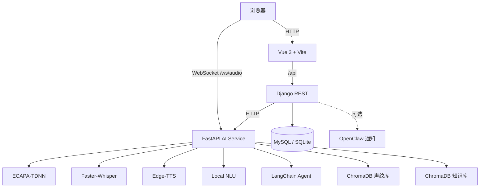

# 🔐 Voice Access Control

> 一个把“声纹识别、语音理解、后台管理、模型训练评估”放在同一仓库中的全栈项目。  
> 当前代码形态更准确地说是：**Vue 3 前端 + Django 业务后端 + FastAPI AI 服务 + ECAPA-TDNN 训练/评估工具链**。

---

## 先讲结论

这个项目不是单一的“门禁页面”，而是由 4 条主线组成：

1. **业务主线**：Django 负责用户、管理员、日志、阈值、模型切换、统计和评估接口。
2. **AI 主线**：FastAPI 负责声纹验证、声纹注册、流式语音处理、Agent 推理、TTS 返回。
3. **前端主线**：Vue 负责普通用户验证页、用户中心、管理员仪表盘。
4. **实验主线**：`scripts/ + configs/ + reports/ + runs/ + checkpoints/` 负责训练、评估、可视化和论文产物。

如果你要对外讲项目，可以直接用一句话概括：

> 这是一个“**运行态系统**”和“**研究态训练链路**”共存的仓库：  
> 运行态负责门禁验证和语音交互，研究态负责训练 ECAPA-TDNN、生成 ROC/EER/噪声鲁棒性等实验结果。

---

## 当前真实架构

### 1. 服务关系



### 2. 与旧 README 不同的关键事实

- 当前仓库里**没有接入 Nginx Gateway**，前端、Django、FastAPI 是直接暴露端口。
- 浏览器的**流式语音 WebSocket 直接连 FastAPI**，不是先经过 Django。
- Django 和 FastAPI 之间通过 `AI_SERVICE_URL` 走 **HTTP 调用**。
- 当前代码里**没有实际 Redis 依赖**，因此编排已清理为无 Redis 版本。
- Docker 编排里原先引用的 `.env.docker` 和 `./models` 并不是当前仓库的真实必要项，已经移除。
- 云端 Agent 依赖 `DEEPSEEK_API_KEY`；如果没有该环境变量，**本地 NLU 仍可工作，但云端问答会降级**。

---

## 你应该怎样理解整体逻辑

### 路径 A：普通 HTTP 声纹验证

适用于上传音频文件做注册 / 验证：

```text
前端上传音频
  -> Django /api/enroll 或 /api/verify
  -> Django 保存音频与业务日志
  -> Django 通过 HttpVoiceService 调用 FastAPI
  -> FastAPI 调用 VoiceService
  -> VoiceService 用 ECAPA-TDNN 提取 embedding
  -> ChromaDB 检索声纹向量
  -> 返回匹配用户、得分、阈值判断
  -> Django 记录 VerifyLog / EnrollLog
  -> 前端展示结果
```

### 路径 B：实时流式语音对话

适用于“边说边识别、边回答”的演示链路：

```text
浏览器麦克风
  -> WebSocket 发送 PCM 到 FastAPI /ws/audio
  -> AudioBuffer + webrtcvad 切分语音段
  -> 并行执行：
     1) 声纹识别：ECAPA-TDNN + ChromaDB
     2) 语音转写：Faster-Whisper
  -> AgentService 决策
     - 高频命令：Local NLU 本地处理
     - 复杂问答：LangChain + DeepSeek + 本地知识库
  -> Edge-TTS 流式回传音频
  -> FastAPI 将交互日志写入 Django 数据库
```

### 路径 C：模型训练与实验评估

适用于毕设 / 论文 / 模型对比：

```text
原始音频
  -> scripts/data/preprocess.py
  -> scripts/data/feature_extraction.py
  -> scripts/train.py
  -> checkpoints/*.pth
  -> scripts/evaluate.py
  -> reports/*
  -> 前端模型页与论文图表
```

---

## 核心模块分工

### 1. `voice_engine/`：AI 核心服务

- `ai_app.py`：FastAPI 入口，提供 `/verify`、`/enroll`、`/transcribe`、`/reload`、`/ws/audio`
- `service.py`：`VoiceService` 单例，封装模型加载、注册、验证、向量检索
- `config.py`：统一路径、模型、阈值、设备、RAG、DeepSeek 配置
- `services/nlu.py`：本地规则 NLU，负责“开门 / 开灯 / 报警”等高频命令
- `services/agent_service.py`：混合智能决策层，先走 Local NLU，再决定是否走云端 Agent
- `services/stt_service.py`：Faster-Whisper 语音转文字
- `services/tts_service.py`：Edge-TTS 文本转语音
- `services/stream_processor.py`：WebSocket 音频缓冲与 VAD 切分
- `services/vector_store.py`：声纹向量库，基于 ChromaDB
- `services/knowledge_service.py`：本地知识库 RAG，基于 Chroma + HuggingFace Embedding
- `core/`：训练期核心代码，包括数据集、损失函数、指标、训练器、ECAPA 模型定义

### 2. `backend/`：业务与管理后端

- `backend/settings.py`：数据库、路径、日志、认证、阈值、OpenClaw 配置
- `api/models.py`：用户档案、管理员安全、高层访问日志、声纹模板、注册日志、验证日志
- `api/model_loader.py`：Django 访问 AI 能力的适配层；优先走远程 FastAPI，否则回退本地 VoiceService
- `api/views/voice.py`：注册、验证、声纹状态
- `api/views/auth.py`：注册、登录、当前用户
- `api/views/users.py`：用户管理、密码重置、声纹清空
- `api/views/admin.py`：管理员管理、模型切换、维护清理
- `api/views/stats.py`：仪表盘统计
- `api/views/roc.py`：ROC/EER/阈值/归一化评估接口
- `api/views/analysis.py`：嵌入图像输出
- `api/tests/test_api_mock.py`：后端接口的基础测试

### 3. `frontend/`：交互层

- `src/views/VoiceVerify.vue`：普通用户主页，支持文件验证和 WebSocket 流式对话
- `src/views/UserProfile.vue`：当前用户信息与个人声纹管理
- `src/views/AdminLogin.vue`：管理员登录页
- `src/views/AdminDashboard.vue`：管理员主控台容器
- `src/views/admin/*`：日志、用户、模型、设置、管理员等拆分子面板
- `src/api.js`：前端到 Django 的 API 封装
- `src/router.js`：路由与管理员权限守卫

### 4. `scripts/`：训练与评估工具链

- `train.py`：模型训练入口
- `evaluate.py`：模型评估入口，支持 score normalization
- `data/preprocess.py`：音频预处理
- `data/feature_extraction.py`：特征提取
- `data/organize_raw.py`：把原始 `mini_vox` 数据整理为 `data/raw`
- `analysis/plot_embedding.py`：嵌入可视化
- `analysis/noise_robustness.py`：噪声鲁棒性实验
- `analysis/summarize_experiments.py`：实验汇总
- `one_click_generate_reports.ps1`：一键生成论文图表与实验产物

---

## 仓库目录怎么读

### 顶层目录

```text
voice_access_control/
├─ backend/                 Django 业务后端
├─ frontend/                Vue 前端
├─ voice_engine/            FastAPI + 声纹 / STT / Agent / TTS
├─ scripts/                 训练、评估、分析脚本
├─ configs/                 脚本配置文件
├─ checkpoints/             训练产出的模型权重
├─ data/                    运行态与实验态共享数据
├─ reports/                 评估输出、图表、指标结果
├─ runs/                    TensorBoard 训练日志
├─ tools/                   辅助工具（如知识库管理面板）
├─ docs/                    技术文档与论文辅助文档
├─ docker-compose.yml       标准部署编排
├─ docker-compose.laptop.yml CPU / 轻量开发编排
├─ Dockerfile               标准 Python 镜像
├─ Dockerfile.laptop        CPU 版镜像
├─ requirements*.txt        Python 依赖
├─ environment.yml          Conda 环境定义
└─ setup.py                 安装入口
```

### `data/` 目录含义

`data/` 不是单一用途目录，而是混合了运行数据、训练数据和中间产物：

- `data/chroma_db/`：运行态声纹向量库
- `data/chroma_knowledge/`：运行态知识库向量库
- `data/enroll/`：用户注册时保存的原始音频
- `data/recordings/`：验证请求保存的音频
- `data/raw/`：按 train / valid / test 划分后的原始数据
- `data/processed/`：预处理后的音频
- `data/features/`：MFCC / LogMel 特征文件
- `data/noise/`：噪声测试音频
- `data/数据/`：历史导入的原始数据源，供整理脚本使用

理解这点很重要：  
**`data/chroma_*` 属于运行态数据库，`data/raw/processed/features` 属于训练实验链路。**

### `reports/` 与 `runs/`

- `reports/`：可直接用于答辩或论文的图表和 JSON 指标
- `runs/`：TensorBoard 原始训练事件文件

---

## 页面与接口对应关系

### 前端页面

- `/`：验证主页
- `/me`：用户中心
- `/login`：管理员登录
- `/admin`：管理后台

### Django 核心接口

- `/api/login/`：登录
- `/api/me/`：当前用户
- `/api/enroll/`：声纹注册
- `/api/verify/`：声纹验证
- `/api/dashboard/`：仪表盘
- `/api/stats/`：统计图数据
- `/api/models/`：模型列表
- `/api/models/switch/`：切换模型
- `/api/roc/`：读取评估结果
- `/api/roc/evaluate/`：触发评估
- `/api/threshold/`：读取 / 保存阈值

### FastAPI 核心接口

- `GET /health`
- `POST /verify`
- `POST /enroll`
- `POST /transcribe`
- `POST /reload`
- `GET /voiceprint/{user_id}`
- `DELETE /voiceprint/{user_id}`
- `WS /ws/audio`

---

## 部署与运行

### 环境要求

- Python 3.9+
- Node.js 18+
- Docker / Docker Compose
- MySQL 8.0（Docker 默认使用）
- CUDA 可选；没有 GPU 可使用 CPU 版编排

### 方式一：标准 Docker 编排

```bash
docker compose up --build
```

默认端口：

- Frontend: `http://localhost:5173`
- Backend: `http://localhost:8000`
- AI Service Docs: `http://localhost:9000/docs`

### 方式二：轻量 CPU 编排

```bash
docker compose -f docker-compose.laptop.yml up --build
```

### 方式三：本地分服务启动

```bash
# 1. Python 依赖
pip install -r requirements.txt

# 2. 启动 AI 服务
python -m voice_engine.ai_app

# 3. 启动 Django
python backend/manage.py migrate
python backend/manage.py runserver 0.0.0.0:8000

# 4. 启动前端
cd frontend
npm install
npm run dev
```

### 推荐环境变量

最重要的配置项：

- `DB_ENGINE`：`django.db.backends.mysql` 或 `django.db.backends.sqlite3`
- `DB_NAME` / `DB_USER` / `DB_PASSWORD` / `DB_HOST` / `DB_PORT`
- `AI_SERVICE_URL`：Django 调 FastAPI 的地址
- `VOICE_VERIFY_THRESHOLD`：验证阈值
- `VOICE_ENGINE_DEVICE`：`cpu` 或 `cuda`
- `DEEPSEEK_API_KEY`：云端 Agent 密钥；未设置时云问答能力会降级

---

## 运维与管理

### 管理后台能做什么

- 查看验证日志、注册日志、管理员访问日志
- 管理普通用户与管理员账号
- 重置密码、清空声纹
- 调整声纹阈值
- 切换当前模型
- 触发 ROC / EER 评估
- 检查模型文件完整性
- 清理旧日志与缓存录音

### 本地向量数据库管理

```bash
streamlit run tools/knowledge_dashboard.py
```

这个工具可以查看：

- 知识库文档
- 语义搜索结果
- 声纹向量集合
- 向量可视化

---

## 开发验证

### 后端测试

```bash
python backend/manage.py test api.tests
```

### 前端构建

```bash
cd frontend
npm run build
```

---

## 开发者文档

- [UPGRADE_ROADMAP.md](docs/UPGRADE_ROADMAP.md)：项目升级路线与阶段规划
- [multimodal_agent_architecture.md](docs/technical_reference/multimodal_agent_architecture.md)：多模态 Agent 设计说明
- [论文报告生成与提交SOP.md](docs/论文报告生成与提交SOP.md)：论文图表与材料生成流程

---

## 许可证

MIT License © 2026 China netcom Team
