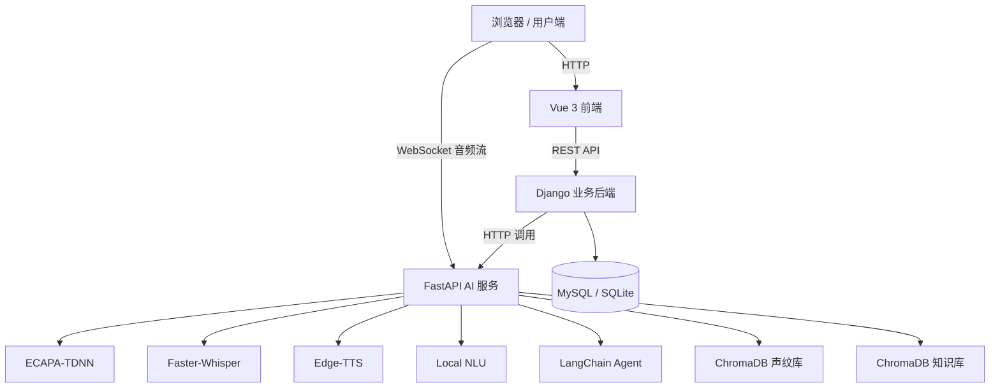
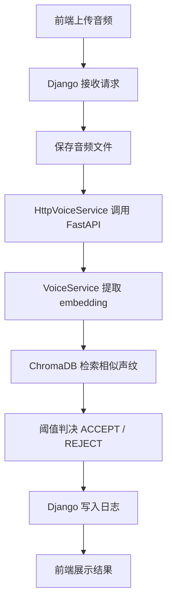
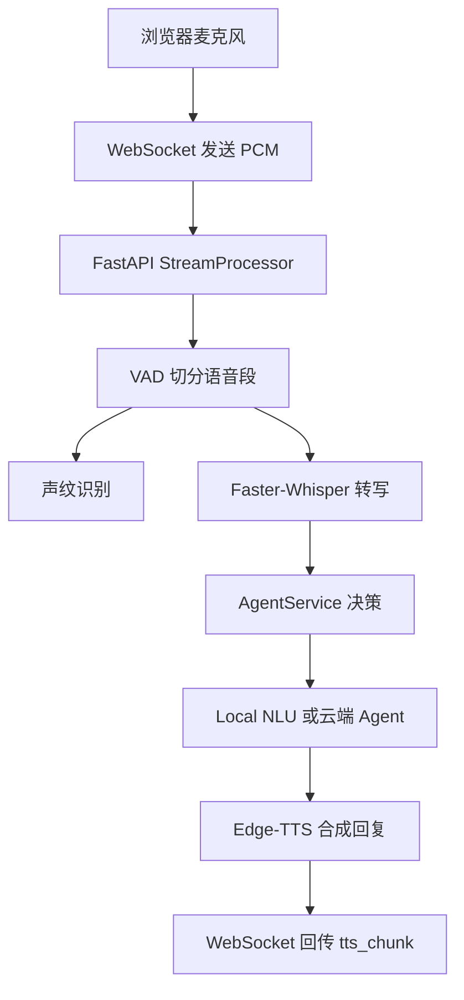
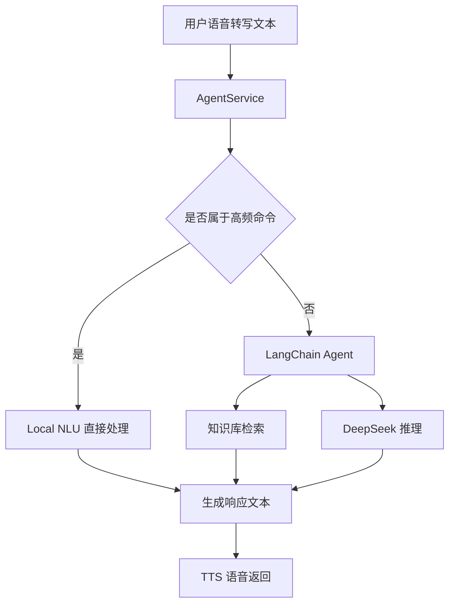

# 系统设计插图草稿

以下内容可直接作为第 4 章插图草稿，再根据论文排版转绘为 Visio、ProcessOn 或 draw.io 图。

## 1. 系统总体架构图

```mermaid
graph TD
    Browser["浏览器 / 用户端"] -->|HTTP| Frontend["Vue 3 前端"]
    Frontend -->|REST API| Backend["Django 业务后端"]
    Browser -->|WebSocket 音频流| AI["FastAPI AI 服务"]
    Backend -->|HTTP 调用| AI

    Backend --> DB[(MySQL / SQLite)]
    AI --> Model["ECAPA-TDNN"]
    AI --> STT["Faster-Whisper"]
    AI --> TTS["Edge-TTS"]
    AI --> NLU["Local NLU"]
    AI --> Agent["LangChain Agent"]
    AI --> ChromaVoice["ChromaDB 声纹库"]
    AI --> ChromaKnow["ChromaDB 知识库"]
```

## 2. HTTP 声纹注册与验证流程图

```mermaid
graph TD
    A["前端上传音频"] --> B["Django 接收请求"]
    B --> C["保存音频文件"]
    C --> D["HttpVoiceService 调用 FastAPI"]
    D --> E["VoiceService 提取 embedding"]
    E --> F["ChromaDB 检索相似声纹"]
    F --> G["阈值判决 ACCEPT / REJECT"]
    G --> H["Django 写入日志"]
    H --> I["前端展示结果"]
```

## 3. WebSocket 实时交互流程图

```mermaid
graph TD
    A["浏览器麦克风"] --> B["WebSocket 发送 PCM"]
    B --> C["FastAPI StreamProcessor"]
    C --> D["VAD 切分语音段"]
    D --> E["声纹识别"]
    D --> F["Faster-Whisper 转写"]
    F --> G["AgentService 决策"]
    G --> H["Local NLU 或云端 Agent"]
    H --> I["Edge-TTS 合成回复"]
    I --> J["WebSocket 回传 tts_chunk"]
```

## 4. 混合智能决策流程图

```mermaid
graph TD
    A["用户语音转写文本"] --> B["AgentService"]
    B --> C{"是否属于高频命令"}
    C -->|是| D["Local NLU 直接处理"]
    C -->|否| E["LangChain Agent"]
    E --> F["知识库检索"]
    E --> G["DeepSeek 推理"]
    D --> H["生成响应文本"]
    F --> H
    G --> H
    H --> I["TTS 语音返回"]
```
